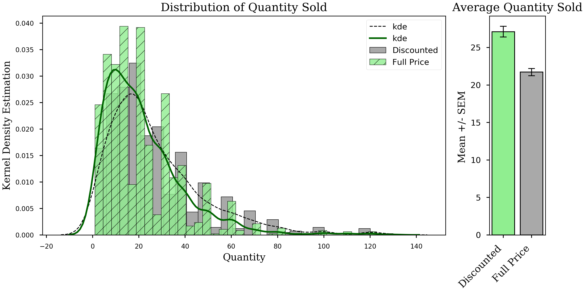

# Forecasting Variable Renewable Energy Production in the EU

**Authors**: Peder Norr

### Introduction:

As the climate crisis continues to grow in severity, more and more countries and utilities are turning towards renewable energy sources as sustainable alternatives to traditional fossil fuel based sources. Chief among these are solar and wind energy. However, these two sources are known as variable renewable energies (VREs), as they are dependent on several variables like the weather. Because of this, integrating VRE sources into a power grid can be difficult due to ever changing levels of output. However, accurate generation forecasts can assuage this issue, and help utilities improve electricity allocation to more efficiently harness VREs.  This project contains analyses of renewable energy generation data in order to provide European countries and utilities a forecast which will allow them to make more accurate energy allocation decisions, and thus better harness the power of renewable energy sources. 


### Business problem:

EU countries and utilities want to be able to better utilize VREs and more efficiently integrate them into their power grids. To that end, they need an accurate estimate of total VRE generation for the upcoming month of July 2021 in order to improve electricity scheduling and allocation. This project will conduct time series analyses, generate forecasts, and calculate total solar and wind energy generation, which will provide EU countries an accurate estimate of VRE generation and enable the more efficient usage of renewable energy.


### Data:

The data used in these analyses come from the European Network of Transmission System Operators for Electricity (ENTSOE) [Transparency Platform](https://transparency.entsoe.eu/dashboard/show). ENTSOE represents 42 electricity transmission system operators from across Europe. It promotes closer cooperation among Europe's TSOs to achieve the EU's energy and climate policy objectives. One of its main objective centers on the integration of renewable energy sources  into the continent's power system.

Additionally, I will be using [entsoe-py](https://pypi.org/project/entsoe-py/), a python client wrapper for the ENTOSE API. This client enables the user to easily retrieve data from the API and return it in DataFrame form. It also automatically splits large requests over multiple API calls.

In order to reduce computation requirements, this project will focus on the top 5 producers of variable renewable energy in the EU: Germany, Italy, France, Spain, and the Netherlands. Due to the granularity of the data and the need for accurate forecasts, the data sets used below are time series from January 2021 to July 2021, containing ~4300 entries of the hourly production of wind and solar energy (in megawatts) in the respective country.


## Methods

In this analysis, I create and iterate through several SARIMA models for each country's time series to create forecasts of future energy generation for solar and wind sources. With those forecasted values, I calculated the total forecasted energy generation for the upcoming month. To reduce computation time, I first identified the top 5 countries in the EU with the highest historical VRE generation and made forecasts for each. I improved my model's iterations by gridsearching to identify optimal hyperparameters, adjusting said parameters, and transforming the data when required. This was done in an attempt to increase the accuracy of the model's forecasts.

## Results

### Here are examples of how to embed images from your sub-folder


#### Visual 1 Title


> Sentence about visualization.

#### Visual 2 Title


> Sentence about visualization.


## Recommendations:

More of your own text here


## Limitations & Next Steps

More of your own text here


### For further information
Please review the narrative of our analysis in [our jupyter notebook](./index.ipynb) or review our [presentation](./SampleProjectSlides.pdf)

For any additional questions, please contact **email, email, email)


##### Repository Structure:

Here is where you would describe the structure of your repoistory and its contents, for exampe:

```

├── README.md               <- The top-level README for reviewers of this project.
├── index.ipynb             <- narrative documentation of analysis in jupyter notebook
├── presentation.pdf        <- pdf version of project presentation
└── images
    └── images               <- both sourced externally and generated from code
└── data
    └── 

```
